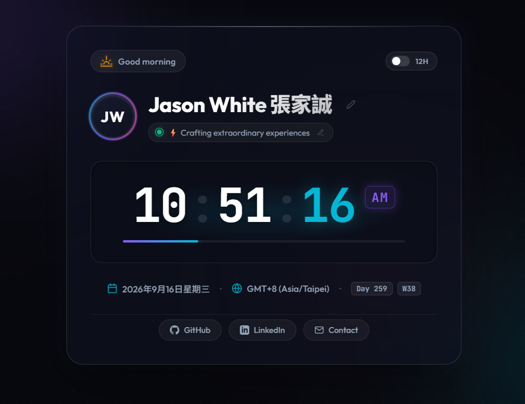

# ⚡ Cyber-Glassmorphic Personal Dashboard

一個具備現代感賽博極光（Aurora）與毛玻璃擬態（Glassmorphism）風格的個人時鐘與儀表板首頁。

<p align="center">
  <a href="https://jasonwhite1012.github.io/-7115056212/">
    
  </a>
</p>

---

## 🚀 Live Demo 線上預覽

🔗 **點此直接瀏覽線上網站**：  
👉 **[https://jasonwhite1012.github.io/-7115056212/](https://jasonwhite1012.github.io/-7115056212/)**

---

## ✨ 核心特色 (Features)

- 🕒 **高精度即時數位時鐘 (Real-Time Digital Clock)**
  - 精確到秒的即時動態跳動與秒數流光進度條。
  - 支援 **12 小時制 (AM/PM)** 與 **24 小時制** 一鍵無縫切換。
  - 採用 *JetBrains Mono* 等寬數位字體（Tabular Numbers），時間跳動平穩不晃動。

- ☀️ **情境化動態問候語 (Dynamic Greeting & Weather Icons)**
  - 依據訪問時的當地時間，自動切換「早安、午安、傍晚、晚安」動態問候。
  - 搭配太陽、日落與月亮的微光 SVG 圖示動畫。

- 👤 **個人化身份與狀態標籤 (Interactive Identity & Focus)**
  - 支援網頁內**即時點擊編輯**姓名與每日狀態。
  - 自動依據姓名生成對應的個人專屬縮寫頭像（如 `JW`）。
  - 所有自訂修改均透過 `localStorage` 儲存於本機瀏覽器，重新整理依然保留。

- 📅 **完整日期與在地時區 (Date & Regional Timezone)**
  - 動態顯示在地時區（如 `GMT+8 (Asia/Taipei)`）。
  - 自動計算目前是當年度的「第幾天（Day of Year）」與「第幾週（Week Number）」。

- 🎨 **前衛賽博極光美學 (Cyber-Glassmorphism Aesthetic)**
  - 流動的環境極光光暈（Aurora Orbs）與微粒紋理。
  - 細緻的毛玻璃層次 (`backdrop-filter: blur(28px)`) 與炫彩漸層微互動按鈕。
  - 完全響應式設計（Responsive Design），在手機、平板與桌機上皆完美適配。

---

## 🛠️ 技術架構 (Tech Stack)

- **結構 (Markup)**：HTML5 語意化標籤
- **樣式 (Styling)**：原生 Vanilla CSS（CSS 變數、Glassmorphism、Flexbox / Grid、CSS Keyframe 動畫）
- **邏輯 (Scripting)**：原生 Vanilla JavaScript（`requestAnimationFrame`、`Intl.DateTimeFormat`、`localStorage`）
- **字型 (Typography)**：Google Fonts (*Outfit* 與 *JetBrains Mono*)

---

## 💻 本地端運行 (Local Development)

本專案為純靜態網頁，無需安裝複雜環境：

1. **複製專案 (Clone)**：
   ```bash
   git clone https://github.com/JasonWhite1012/-7115056212.git
   cd -7115056212
   ```

2. **開啟網頁**：
   - 直接用任何瀏覽器雙擊開啟 `index.html` 即可立即預覽。

---

## 👤 作者 (Author)

**Jason White (張家誠)**
- GitHub: [@JasonWhite1012](https://github.com/JasonWhite1012)
